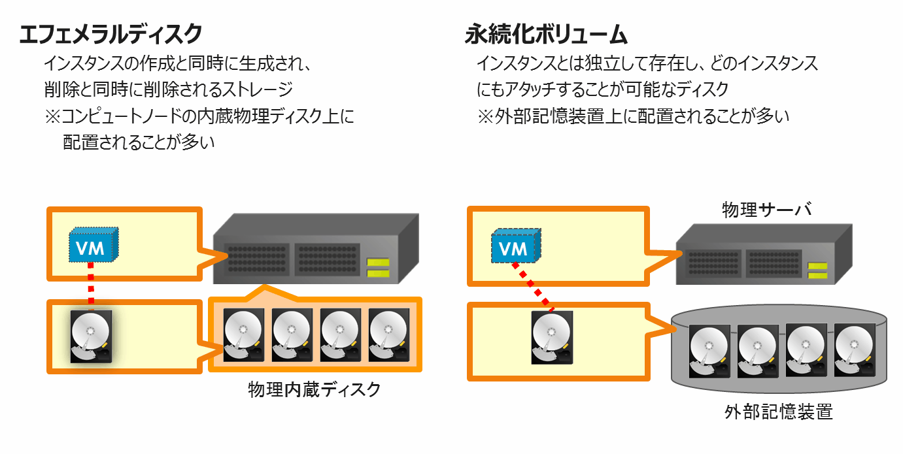

クラウド上のストレージの概念
================

----

概要
================

- エフェメラルディスクと永続化ボリューム
- オブジェクトストレージとは

----

エフェメラルディスクと永続化ボリューム
================

- クラウド上の仮想サーバーから利用するブロックストレージには2つの種類があります。

----

オブジェクトストレージ
================

- OpenStackにはSwiftというオブジェクトストレージ機能があります。オブジェクトストレージには以下のような特徴があります。

----

ストレージ特性とデータ保護
================

- 各ストレージの特性をデータ保護の観点からみると

  -----------
　　エフェメラルストレージ < 永続化ボリューム < オブジェクトストレージ
  -----------
